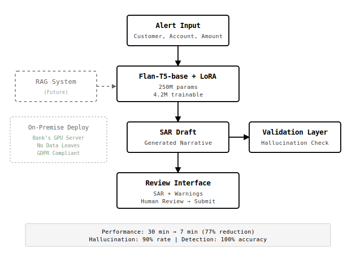

# UK SAR Generator

**What if you could make compliance officers' lives 77% less tedious?**

I fine-tuned a language model to write financial compliance reports. Then it started making up customer IDs. Then I built a system to catch it lying. This is that story.

**🔴 [Live Demo](https://huggingface.co/spaces/Raga10/UK-SAR-Generator)** ← Try breaking it

---

## The Problem

Banks file Suspicious Activity Reports (SARs) to report potential money laundering. Each one takes about 30 minutes to write. They follow the same structure every time:

- "On [date], account [number] processed a transaction of [amount]..."
- "This exhibits characteristics consistent with [suspicion type]..."
- "Under POCA 2002 Section 330, disclosure is required..."

Same citations. Same format. Different numbers.

I thought: this is exactly the kind of repetitive-but-structured task an LLM should be able to learn. Can I make a model that generates the draft so compliance officers just review and fix, instead of writing from scratch?

---

## What I Built

A fine-tuned **Flan-T5-base** (250M parameters - small by today's standards) that takes an alert and generates a SAR draft in 30 seconds.

**The workflow:**
1. Alert comes in → Model generates draft
2. Validation checks for hallucinations
3. Human reviews, fixes anything wrong, submits
4. **Total time: 7 minutes** (down from 30)

For a bank doing 500 SARs a month, that's **192 hours saved**. About £115k/year in labor costs.

---

## What Actually Happened (The Fun Part)

### "I'll just fine-tune it and it'll work"

First attempt: Fine-tuned on 200 synthetic SAR examples. Looked good in training. Generated some test cases. They read beautifully - professional language, proper structure, cited the right laws.

Then I looked closer.

### "Wait, where did CUST8686 come from?"

Input: